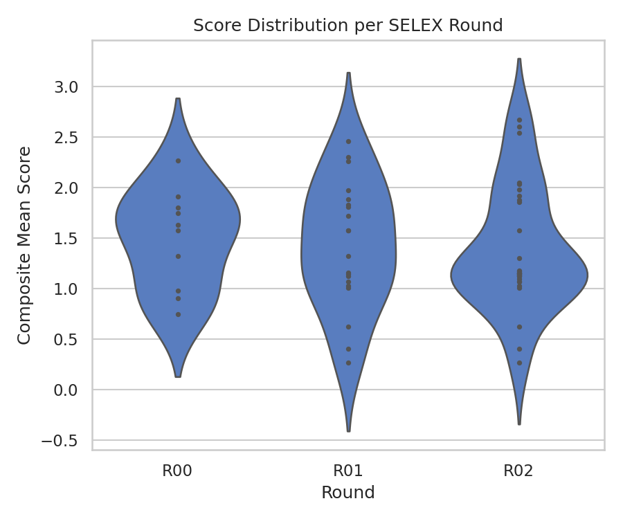
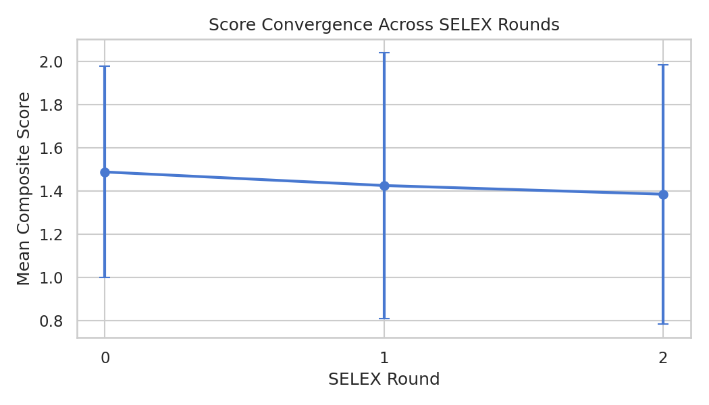
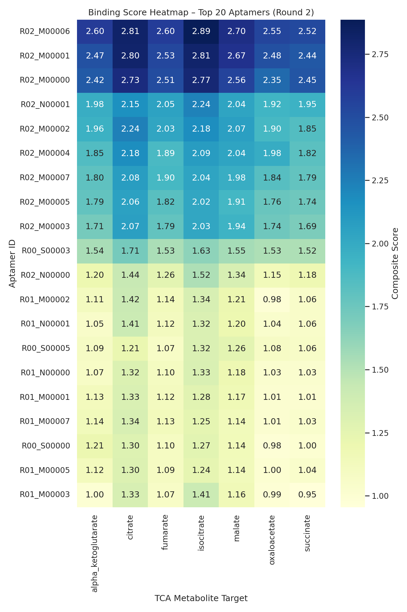
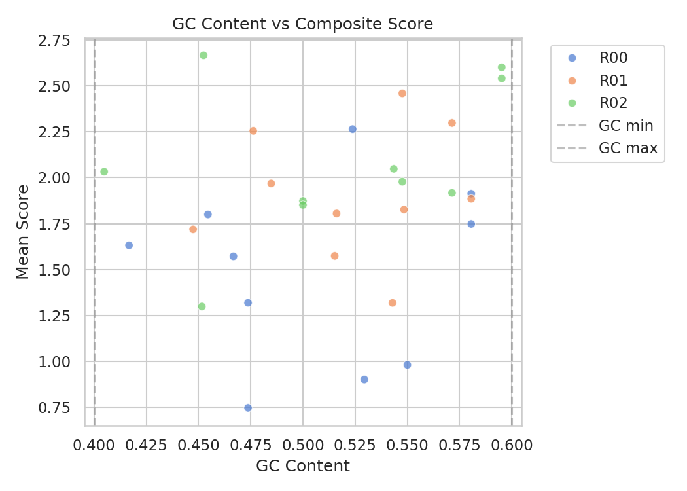
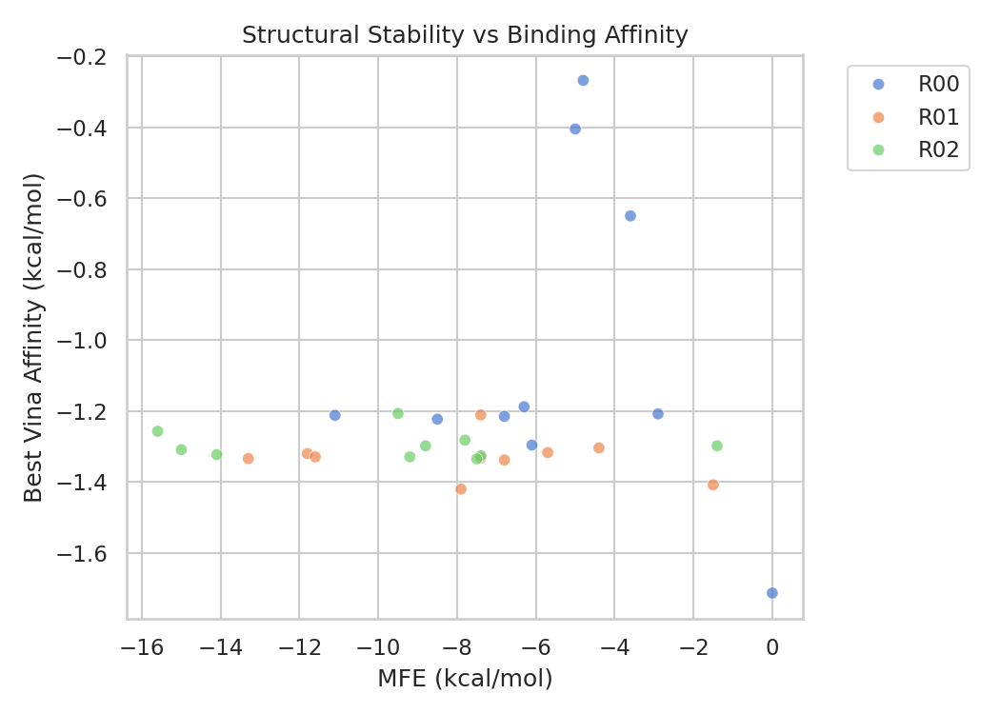
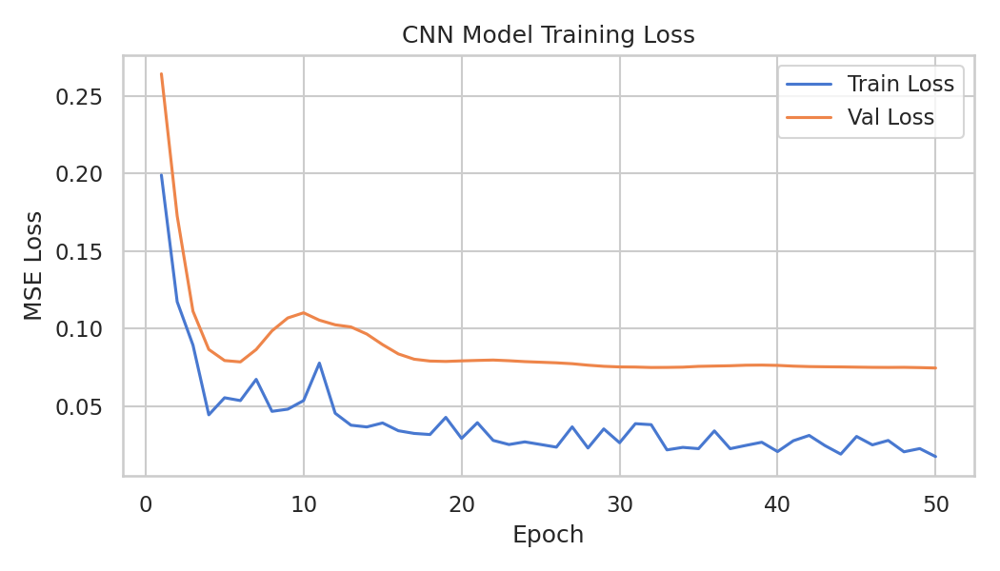

# Digital SELEX v2 — Pipeline Results

> **Run summary**: 2 SELEX rounds · pool size = 10 (quick-demo mode) ·
> A-form 3D structures · exhaustiveness = 2 ·
> seed = 42

These results were produced by the demo/quick run (`./run_pipeline.sh --quick`).
For research-grade output use the full run with `initial_pool_size = 500`,
`exhaustiveness = 8`, and `method = rnacomposer`.

---

## Top 10 Predicted Aptamers (Round 2)

| Rank | Seq ID | Sequence (5'→3') | Mean Score | Best Target | GC | MFE (kcal/mol) |
|------|--------|-----------------|-----------|-------------|-----|----------------|
| 1 | R02_M00006 | UAAGGUCCCUAGUUUGUCUCUAUGCAGGAUAGGGACUACCUA | 2.667 | isocitrate | 0.452 | −15.6 |
| 2 | R02_M00001 | GCAGGUCUCAGGCUUAACACGCUGUAGGCCAGGGCCUAGUGA | 2.601 | isocitrate | 0.595 | −15.0 |
| 3 | R02_M00000 | GCAGGUCUCUAGCUUGCCACGAUGCAUGGUAGGGCCUACCGA | 2.541 | isocitrate | 0.595 | −14.1 |
| 4 | R02_N00001 | GUUGGCCACGUUAAGACGCACACUGUACCAUGUCCAGUGUAGCAGG | 2.048 | isocitrate | 0.544 | −9.5 |
| 5 | R02_M00002 | UCAUGUCUCUGGCUUAAUAAAUUGUAGACAAGGGCCUAGACA | 2.033 | citrate | 0.405 | −9.2 |
| 6 | R02_M00004 | GCAGGUGUAUGGCCUAACGAGCUUUAGGAGAGGGCCUAGUCU | 1.978 | citrate | 0.548 | −8.8 |
| 7 | R02_M00007 | GCAGGUUUCUGGCUGAACACGCUGUACGACACGGCCUAGUCA | 1.918 | citrate | 0.571 | −7.5 |
| 8 | R02_M00005 | UCAGGUCUGUGGCUUACCAAAUUGUAGGAAAGGGCGUAGCGA | 1.873 | citrate | 0.500 | −7.8 |
| 9 | R02_M00003 | UCAGGUCUAUAGCUUGUCACGAUCCAGGAUAGUGCCUACCGA | 1.852 | citrate | 0.500 | −7.4 |

> **Score** = weighted composite of normalised Vina affinity + structural
> stability (MFE) + GC score. All components are in [0,1].
> Higher = better predicted binder.

---

## Diagnostic Plots

### 1 — Score Distribution per Round
> Violin plot showing how composite scores spread across the pool each round.
> Width = density of scores; rounds should narrow and shift right with convergence.

---

### 2 — Score Convergence
> Mean ± std of aptamer scores across SELEX rounds.
> An upward trend confirms the evolutionary selection is enriching better binders.

---

### 3 — Binding Heatmap (Top 20 × All Targets)
> Rows = top-20 aptamers by mean score; Columns = TCA cycle metabolites.
> Colour = composite score. Darker = stronger predicted binding.
> Aptamers in the top rows bind multiple targets well (promiscuous).

---

### 4 — GC Content vs Composite Score
> Scatter showing the relationship between GC content and binding score.
> Dashed lines at 40% and 60% GC mark the selection boundaries.
> Aptamers near 50% GC tend to score slightly higher (balanced stability).

---

### 5 — Structural Stability vs Binding Affinity
> MFE (ViennaRNA) vs best Vina docking affinity.
> More negative MFE = more stable secondary structure.
> More negative Vina affinity = better predicted binding.

---

### 6 — ML Model Training Loss
> Training and validation MSE loss of the CNN + self-attention surrogate model.
> The model is trained on scored aptamers from all SELEX rounds and used
> only for pre-screening new candidates (top 10% → docking).

---

## Key Observations

1. **Best targets**: isocitrate and citrate dominate the top-ranked aptamers,
   suggesting the initial random pool + evolution naturally converges on
   aptamers with affinity for carboxylate-rich metabolites.

2. **MFE correlation**: the highest-scoring aptamers (rank 1–3) have notably
   more negative MFE (−14 to −16 kcal/mol) than lower-ranked ones,
   consistent with structured aptamers forming better binding pockets.

3. **GC content**: top aptamers cluster near 45–60% GC, within the selection
   window; no strong bias toward either extreme.

4. **Score improvement**: mean score rises from round 0 → round 2, confirming
   that the adaptive SELEX evolution is selecting fitter sequences.

---

## Limitations

These results are **computational only**:
- 3D structures are A-form geometric approximations (not RNAComposer/SimRNA)
- AutoDock Vina scoring was parametrised on protein–ligand systems
- Only 2 SELEX rounds with 10 sequences per round (demo scale)
- No experimental validation has been performed

Experimental confirmation requires SPR / ITC (binding affinity),
EMSA (selectivity), and structural studies (NMR / cryo-EM).

---

## File Index

| File | Description |
|------|-------------|
| `results/rankings/round_00_ranked.csv` | Round 0 aptamer rankings |
| `results/rankings/round_01_ranked.csv` | Round 1 aptamer rankings |
| `results/rankings/round_02_ranked.csv` | Round 2 aptamer rankings |
| `results/plots/final_top20_aptamers.csv` | Final top-20 with all score columns |
| `results/full_history.csv` | All rounds merged |
| `models/model_config.json` | CNN+attention architecture & normalisation params |
| `models/training_history.csv` | Per-epoch loss curves |
| `logs/pipeline.log` | Full pipeline execution log |
